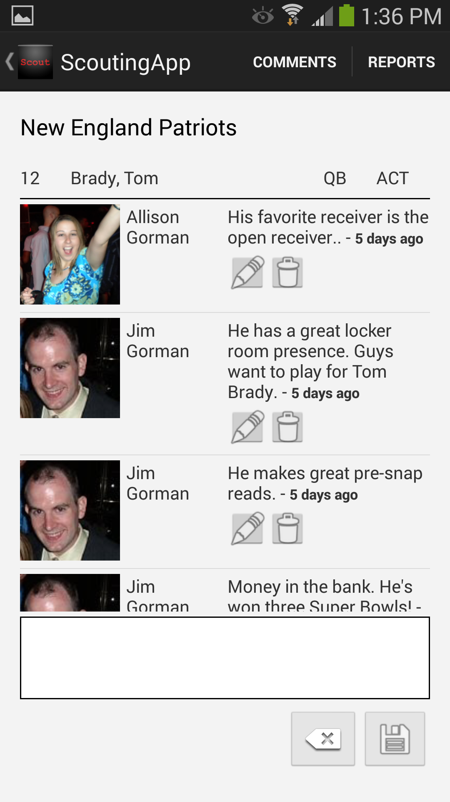

ScoutingApp
===========

<h4>Be the scout in the stands!</h4>

ScoutingApp is an Android app which lets fans weigh in on the action on the field!

Is your quarterback poised to dominate? Have concerns about your kicker? Can those draft picks fill a need?

Let ScoutingApp know what you think!

[Download it now at the Google Play store.](https://play.google.com/store/apps/details?id=com.jimg.scoutingapp)

#### Product Features
 * Includes the ability to comment on any active professional football player.
 * Rosters are updated on a daily basis.
 * Includes a "Top Users" report that lists the users who have posted the most comments.
 * Inclues an "All Users" report that lists how many comments have been posted for each team.
 * No need for a password. As long as you have Google Play Services installed, you can use your pre-existing Google+ account to sign in.
  * Sign in is not necessary for read-only mode.
 * All comments are linked to the user's Google+ account, and the user's Google+ picture will appear next to each post.
 * If location services has as "last location" then the app will use that to guess your favorite team (randomized between the Jets and Giants for users who are close to MetLife Stadium).
 * Includes full support for the back button.
 * Includes the ability to flag a comment for rude or offensive content.
 * Includes an admin screen to act upon flagged comments.

#### Technical Features
 * [Google+ Sign-On](https://developers.google.com/+/mobile/android/sign-in).
 * Integration with location services and the [Fused location provider](http://www.kpbird.com/2013/06/fused-location-provider-example.html).
 * Implemented with one main activity and many [fragments](http://developer.android.com/guide/components/fragments.html) that all exist within the main activity's life cycle.
  * Each fragment transaction is added to the fragment back stack which is managed by the activity.
 * Includes an ActionBar menu.
 * Includes custom adapters that use the ViewHolder pattern to optimize user experience when viewing ListViews.
 * Uses [Jake Wharton's Butterknife library](https://github.com/JakeWharton/butterknife) to eliminate boilerplate findViewById calls.
 * Uses [Frankie Sardo's Icepick library](https://github.com/frankiesardo/icepick) to simplify the lifecycle of save and restore instance state.
 * Uses [Koush's Ion library](http://koush.com/post/ion) to simplify asynchronous network calls.
 * Uses the [Universal Image Loader library](https://github.com/nostra13/Android-Universal-Image-Loader) to simplify image caching and image memory management.
 * Monitors for airplane mode and a loss of network connectivity to remind the user that network connectivity is required for the app to function properly.
 * Includes an error logging/phone home feature to send stack traces home and to prevent the app from crashing wherever possible.
 * Connects to [Scouting.RestService](https://github.com/JimGorman17/Scouting.RestService) for a RESTful backend.
 * Developed with Android Studio, primarily tested with a Samsung Galaxy S4.

